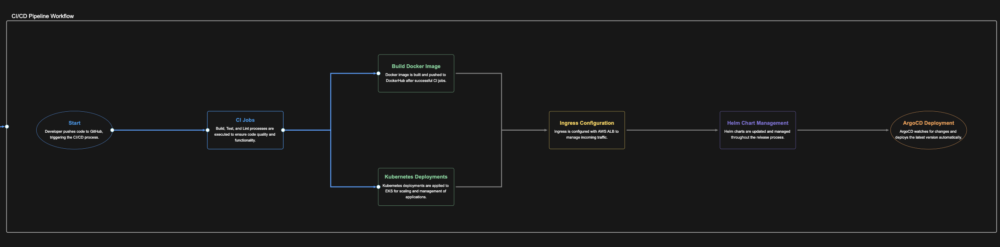

# DevOps Pipeline: CI/CD Workflow for a Go Web Application

This project demonstrates a **fully automated CI/CD pipeline** for deploying a **Go web application** on **AWS EKS** using **Docker, Kubernetes, Helm, and ArgoCD**.

---

## 📌 CI/CD Pipeline Workflow

![CI/CD Pipeline Workflow]



---

## 🚀 Step 1: Develop & Containerize the Application

### ✅ Build & Run the Go Application Locally
```sh
go build -o main
go run main.go
```

### ✅ Containerization with Docker
- Create a **multi-stage Dockerfile** using a **distroless base image**.
- Build the Docker image:
```sh
docker build -t <dockerhub-username>/go-web-app:v1 .
```
- Run the container locally:
```sh
docker run -p 8080:8080 -it <dockerhub-username>/go-web-app:v1
```
- Push the image to DockerHub:
```sh
docker push <dockerhub-username>/go-web-app
```

---

## 🏗 Step 2: Kubernetes Deployment

### ✅ Set Up AWS EKS Cluster
```sh
eksctl create cluster --name demo-cluster --region us-east-1
```

### ✅ Deploy Application on Kubernetes
- Apply Deployment:
```sh
kubectl apply -f deployment.yaml
```
- Expose Service via ClusterIP:
```sh
kubectl apply -f service.yaml
```

### ✅ Enable External Access Using Ingress
- Apply Ingress:
```sh
kubectl apply -f ingress.yaml
```

---

## 🌐 Step 3: Ingress Controller Setup (AWS ALB)
- Install **Nginx Ingress Controller**:
```sh
kubectl apply -f https://raw.githubusercontent.com/kubernetes/ingress-nginx/controller-v1.11.1/deploy/static/provider/aws/deploy.yaml
```
- Get the **Load Balancer Address**:
```sh
kubectl get svc -n ingress-nginx
```
- Map the Load Balancer IP to Local DNS:
```sh
nslookup <LoadBalancer-Address>
sudo vim /etc/hosts  # Add go-web-app.local
```

---

## 📦 Step 4: Helm for Kubernetes Configuration Management
- Create a **Helm Chart**:
```sh
helm create go-web-app-chart
```
- Customize `values.yaml` for **dynamic image updates**.
- Deploy Helm Chart:
```sh
helm install go-web-app go-web-app-chart/
```

---

## 🔄 Step 5: Implement CI/CD with GitHub Actions & ArgoCD

### ✅ **CI (Continuous Integration) - GitHub Actions**
- **Pipeline Jobs:**
  - **Build & Unit Test**:
  ```sh
  go build -o go-web-app
  go test ./...
  ```
  - **Static Code Analysis**:
  ```sh
  golangci-lint run
  ```
  - **Docker Image Build & Push**:
  ```sh
  docker build -t <dockerhub-username>/go-web-app:<tag> .
  docker push <dockerhub-username>/go-web-app:<tag>
  ```
  - **Update Helm Chart with New Image Tag**:
  ```sh
  sed -i "s/tag:.*/tag: <tag>/" helm/go-web-app-chart/values.yaml
  ```

### ✅ **CD (Continuous Deployment) - GitOps with ArgoCD**
- Install **ArgoCD**:
```sh
kubectl create namespace argocd
kubectl apply -n argocd -f https://raw.githubusercontent.com/argoproj/argo-cd/stable/manifests/install.yaml
```
- Expose **ArgoCD UI** via Load Balancer:
```sh
kubectl patch svc argocd-server -n argocd -p '{"spec": {"type": "LoadBalancer"}}'
```
- Get the **ArgoCD UI IP**:
```sh
kubectl get svc argocd-server -n argocd
```
- Deploy Application via **ArgoCD**:
```sh
argocd app create go-web-app --repo <repo-url> --path helm/go-web-app-chart --dest-server https://kubernetes.default.svc --dest-namespace default
```

---

## 🎯 Final Deployment
- Verify Deployment Status:
```sh
kubectl get pods
kubectl get svc
kubectl get ingress
```

---

## 🛠 Technologies Used
- **Go** (Backend)
- **Docker** (Containerization)
- **Kubernetes** (Orchestration)
- **AWS EKS** (Managed Kubernetes)
- **Helm** (Package Management)
- **GitHub Actions** (CI Pipeline)
- **ArgoCD** (CD Pipeline)
- **Nginx Ingress Controller** (Traffic Management)

---

## 🚀 Next Steps
- Implement **Terraform** for full **Infrastructure as Code (IaC)**.
- Add **Monitoring & Logging** (Prometheus, Grafana).
- Automate **Security Scanning** (Trivy, SonarQube).

---


